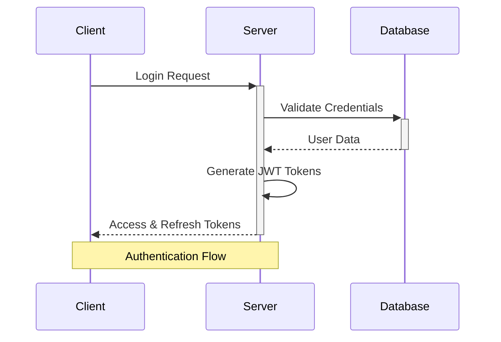
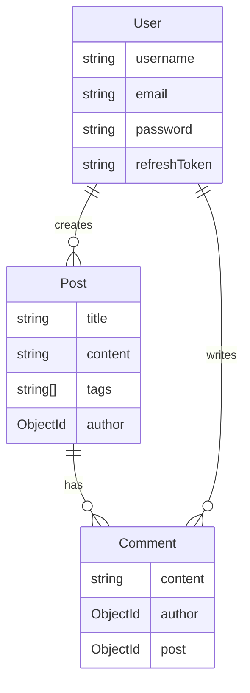

# Blog API - NestJS & MongoDB Backend Implementation

[](https://nestjs.com/)
[](https://www.mongodb.com/)
[](https://www.typescriptlang.org/)

> Note: This is the backend part of a blog application. For the full-stack version, you're gonna find soon in this repo => [Blog Full-Stack Repository](fullStackLink).

## 🏗 Architecture

### Authentication Flow


### Database Schema


## 🚀 Features

- **Authentication**
  - JWT-based authentication
  - Access & Refresh token system
  - Secure password hashing
  - User registration and login

- **User Management**
  - Profile management
  - Profile picture support
  - Secure password updates

- **Blog Posts**
  - Create, read, update, delete posts
  - Pagination support
  - Image upload support
  - Tags system

- **Comments**
  - Add comments to posts
  - Delete comments
  - Comment author tracking

## 🛠 Tech Stack

### Core
- **Runtime**: Node.js v18
- **Framework**: NestJS v10
- **Language**: TypeScript v5
- **Database**: MongoDB v7 with Mongoose v8

### Authentication & Security
- **JWT**: @nestjs/jwt
- **Password Hashing**: bcrypt
- **Auth Strategy**: @nestjs/passport, passport-jwt
- **Validation**: class-validator, class-transformer

### Development Tools
- **Package Manager**: npm
- **Code Style**: ESLint, Prettier
- **Testing**: Jest
- **API Testing**: Postman Collection included

## 🏃‍♂️ Quick Start

1. **Clone the repository**
   ```bash
   git clone [your-repo-url]
   cd api
   ```

2. **Install dependencies**
   ```bash
   npm install
   ```

3. **Environment Setup**
   Create `.env`:
   ```env
   MONGODB_URI=your_mongodb_uri
   JWT_SECRET=your_jwt_secret
   JWT_REFRESH_SECRET=your_refresh_secret
   JWT_ACCESS_TOKEN_EXPIRATION_TIME=15m
   JWT_REFRESH_TOKEN_EXPIRATION_TIME=7d
   ```

4. **Start the server**
```bash
   npm run start:dev
   ```

## 📝 API Documentation

### Auth Routes
```
POST /auth/register - Register new user
POST /auth/login    - Login
POST /auth/refresh  - Refresh token
POST /auth/logout   - Logout
```

### User Routes
```
GET    /user/me     - Get profile
PATCH  /user/me     - Update profile
```

### Post Routes
```
GET    /posts       - Get all posts
GET    /posts/:id   - Get single post
POST   /posts       - Create post
PATCH  /posts/:id   - Update post
DELETE /posts/:id   - Delete post
```

### Comment Routes
```
GET    /posts/:postId/comments    - Get comments
POST   /posts/:postId/comments    - Add comment
DELETE /comments/:id              - Delete comment
```

## 🔒 Authentication Flow

1. **Registration**
   - User registers with email/password
   - Password is hashed with bcrypt
   - User document created in MongoDB

2. **Login**
   - User provides credentials
   - Receives access & refresh tokens
   - Access token expires in 15 minutes
   - Refresh token expires in 7 days

3. **Protected Routes**
   - Send access token in Authorization header
   - Format: `Bearer <token>`
   - Guards validate token
   - User info attached to request

4. **Token Refresh**
   - Use refresh token to get new access token
   - Old refresh token invalidated
   - New tokens issued

## 📦 Project Structure

```
src/
├── auth/           # Authentication module
├── user/           # User module
├── post/           # Post module
├── comment/        # Comment module
├── common/         # Shared resources
└── config/         # Configuration
```

## 🧪 Testing

```bash
# unit tests
npm run test

# e2e tests
npm run test:e2e

# test coverage
npm run test:cov
```

## 📜 License

MIT License - feel free to use this code for your own projects.